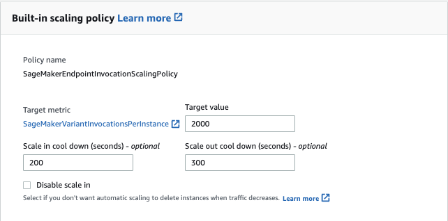

# Startup Valuation with Machine Learning

Startup valuation is a crucial and often complex process, as it involves predicting the future potential and success of a company that is still in its early stages of growth. Traditional methods of valuation such as the discounted cash flow method and the Berkus approach can be time-consuming and subjective. To assist startup investors with their decisions, in this project we aim to find the important features that lead to startup success and provide an API for forecasting a company’s valuation with supervised machine learning methods.

## File structure explanation

```
├───data
├───model
└───scripts
```
/data
 - data csv files for modeling 

/model
 - code for training model

/scripts
 - data cleaning script: clean data from crunchbase dataset
 - lambda function script: process result from API endpoint and relay to AWS sagemaker model for prediction

## Tech stack

**Data cleaning**: Pandas

**Machine Learning**: Scikit-Learn, Jupyter Notebook, AWS SageMaker

**Deployment**: AWS Lambda, AWS API Gateway, AWS S3, AWS CloudWatch

## Code explanation


### Ingestion

Initial data sourced through kaggle https://www.kaggle.com/datasets/justinas/startup-investments from Crunchbase 2013 Snapshot © 2013

Much of the data however, was unusable because the target variable (i.e. the valuation of the startup) was not provided hence our eventual dataset consisted of just below 1000 data points. However, we believe this is adequate to train a reliable model.

### Cleaning / Preprocessing

Using Pandas, the tables from the datasets were merged to give the input for modeling, with columns that we find useful to the model. The features used are as shown below:

| Category | Features |
| --- | --- |
| General | created_at, funding_rounds, funding_total_usd, number_of_members, number_of_founders |
| Funding | funding rounds, amount raised (each round), currency = usd, number of vc invested, total funds from vc |
| Financial history | number of funding rounds, total amount, mean amount, max amount |
| Result | pre_money_valuation, post_money_valuation |

### Modeling

Modelling the startup valuation is a complex problem where the variables utilized have to be carefully handpicked. As such, we took reference to a written research paper: Valuation of Startups: A Machine Learning Perspective. It discussed how they used 3 different types of models to predict the valuation of the startups, including multilayer perceptrons, Domain Adaptation Neural Networks and CatBoost. It eventually concluded that CatBoost gave the best results, hence we decided to go with a similar gradient boosting method, XGBoost.

From there, we also decided to utilize data that revolves around a funding round of the said startup, with a disclosed funding amount provided. 

We divided the data into training and test sets, with a test_size of 0.2 so that we could conduct validation tests on the test sets subsequently.

Eventually, we achieved an eventual root mean square error (rmse) of approximately 0.13, which we consider to be satisfactory.

The model was then deployed into the AWS S3 bucket for us to retrieve to use on the API.

### Deployment

Deployment of our application was made possible with the use of AWS Lambda and API Gateway. By utilizing AWS Lambda, we were able to create a serverless environment for the endpoint generated using AWS Sagemaker.

Furthermore, we utilized AWS API Gateway to establish a REST API. When a POST request is received, the API Gateway triggers the corresponding Lambda function, which houses the logic for making predictions using our model. The API Gateway then returns the output from the Lambda function to the client, providing a smooth and efficient process.

Next, to make the Machine Learning model scalable, we leverage the auto scaling feature in AWS so that multiple investors can access the endpoint with low latency. We have decided to perform a theoretical calculation and derived an assumption that there are around 125,000 active investors worldwide every minute which equates to 2,000 requests per seconds. Hence, the target value is 2,000 as shown below.

During our team development on AWS Cloud environment, we also utilized the AWS CloudWatch logs to debug for errors and fixed our errors eventually along the way.
 
 

## Usage

To try out our endpoint, you can import the Postman collection located at [https://github.com/kaixiangtay/Startup-Valuation-with-Machine-Learning/blob/main/StartupValuationPrediction.postman_collection.json](https://github.com/kaixiangtay/Startup-Valuation-with-Machine-Learning/blob/main/StartupValuationPrediction.postman_collection.json).

The above collection includes a sample payload and makes a POST request to our endpoint!

The endpoint is located at: [https://67o14eof6e.execute-api.ap-southeast-1.amazonaws.com/api/startupvaluationprediction](https://67o14eof6e.execute-api.ap-southeast-1.amazonaws.com/api/startupvaluationprediction)

## References

Garkavenko, M., Mirisaee, H., Gaussier, É., Guerraz, A., & Lagnier, C. (2021). Valuation of Startups: A Machine Learning Perspective. ECIR.
